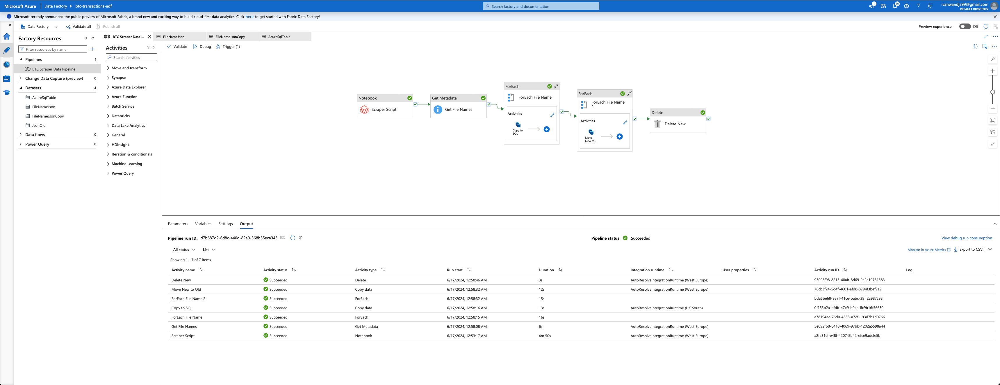
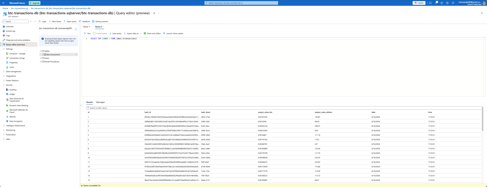

# Bitcoin-Transaction-Scraper

## Overview

This project is designed to scrape unconfirmed Bitcoin transactions from blockchain.com and store the data efficiently in an Azure Data Lake. Utilizing the power of Azure Data Factory and Databricks, the data is processed and moved seamlessly to ensure up-to-date information is available for further analysis.

## Architecture and Workflow

Here's a step-by-step breakdown of how the system works:

1. **Data Scraping with Databricks**: 
    - A Databricks script is responsible for scraping unconfirmed Bitcoin transactions from blockchain.com.
    - The script runs every minute, ensuring that the data is always fresh.
    - The scraped data is stored in JSON format and saved under the "new" directory in the Azure Data Lake.

2. **Data Storage and Processing**:
    - Azure Data Factory orchestrates the entire pipeline.
    - After the data is stored in the "new" directory, it is then transferred to an Azure SQL Database. This allows for efficient querying and analysis.
    - Once the data is successfully inserted into the SQL database, the JSON files in the "new" directory are moved to the "old" directory. This step ensures that the "new" directory is ready to receive fresh data in the next cycle.

3. **Pipeline Scheduling**:
    - The pipeline is scheduled to run every minute, making sure that the data is always up-to-date.
    - This frequent update cycle is crucial for maintaining the relevancy of the data, especially for applications that rely on the latest transaction information.
   

   

## Why This Approach?

- **Scalability**: Azure Data Lake and SQL Database offer scalable storage solutions, accommodating growing data volumes. 
- **Automation**: Azure Data Factory and Terraform automate the entire workflow, reducing manual intervention and potential errors. 
- **Efficiency**: Databricks provides a robust environment for data scraping and processing, ensuring data is handled efficiently and effectively. 
- **Organization**: The separation of "new" and "old" directories maintains a clean and organized data storage system, making data management easier.

## Getting Started

To get started with this project, you need to have the following prerequisites:

1. **Terraform**: Make sure to have Terraform installed in order to build all resources needed faster.
2. **Azure Subscription**: Ensure you have an active Azure subscription to use Azure Data Factory, Azure Data Lake, and Azure SQL Database.
3. **Databricks Workspace**: Set up a Databricks workspace where the scraping script will run. 
4. **Storage Mount Configuration**: Setup a storage mount in Databricks for seamless access to Azure Data Lake.
5. **Data Pipeline Configuration**: Configure the Azure Data Factory pipeline according to the workflow described above.

## Automation

All Azure resources are provisioned and managed using Terraform, ensuring consistent and repeatable deployments. The pipeline runs every minute, facilitated by Azure Data Factory’s scheduling capabilities.
( [Terraform Script](main.tf) )

## Conclusion

This project provides a robust solution for scraping, storing, and processing unconfirmed Bitcoin transactions. By leveraging Azure's powerful data services, we ensure that the data is always fresh, well-organized, and ready for analysis. 

**Note**: More data will be scraped in addition to what is already there.

Happy Scraping!

## References
https://registry.terraform.io/providers/hashicorp/azurerm/latest/docs

https://learn.microsoft.com/en-us/python/api/overview/azure/storage-file-datalake-readme?view=azure-python#client-creation-with-a-connection-string